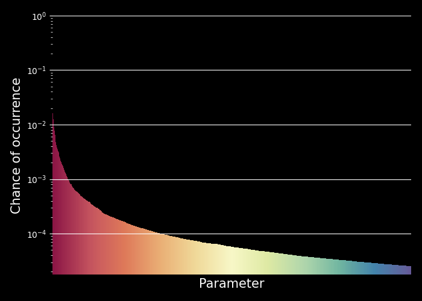

# Samlists

You'll never find what you're not looking for, so these wordlists are:

1. **Comprehensive**. These wordlists are constructed by trawling through terabytes of data mapping to many billions of unique websites. You'd be hard pressed to find a larger source dataset.

2. **Based on RECENT data**. Tech evolves fast, why shouldn't wordlists? The wordlists are based exclusively on crawl data from up to a year ago, to accurately map out websites as they look today.

3. **Created with SCIENCE**. By using some data science to remove outliers, generally crappy results and much else we remove much of the human element and biases to give you much more relevant and language-agnostic results. 

4. **Magical**. The construction of these wordlists is automagic, meaning in a year from now this github repo will still have up-to-date and high quality wordlists.

5. **Sorted**. By rows being sorted from most likely to occur to least likely, your chances of finding juicy stuff as fast as possible is much better, making the wordlists uniquely suitable when speed *AND* comprehensiveness are required.

As you can see, the top 3000 rows in the parameters wordlist map quite beautifully to their likelihood of being found in websites.

## Wordlists

| Wordlist name  | Size |  Description            |
| ------------- | ------------- |------------- |
| samlists-parameters.txt  | ~52K rows  | HTTP parameter names (basically what would go in `{here}` for the URL `http://example.com?{here}=value`).             |
| samlists-parameters-lowercase.txt  | ~47K rows  | Same as `samlists-parameters.txt` but converted to lowercase and deduplicated (while preserving order). I recommend using the mixed case wordlist unless you are sure your target is case insensitive as items in this list are not exactly how they were discovered during the crawl (e.g. `Itemid` is actually a lot more common than `itemid` ).             |

Wordlists for directories and files are in the works too, but even with 128 GB of memory crunching terabytes of data is hard. :)

## Methodology

The wordlists are created by trawling through [CommonCrawl](https://CommonCrawl.org)'s terabytes of crawl data while aggregating URLs and using a variety of statistical techniques to thwart bad examples, like for example:

1. Only allowing each relevant value to count once per domain, which allows the wordlist to have its items be sorted in order of usefulness (i.e. chance that any random website will be affected) rather than letting over-crawled websites dominate.
2. Pruning items that are too rare to be of general interest based on their rate of occurrence
3. Using shannon entropy to remove random values, tokens and UUIDs.
4. Removing items that are broken due to incorrect encoding and/or decoding.
